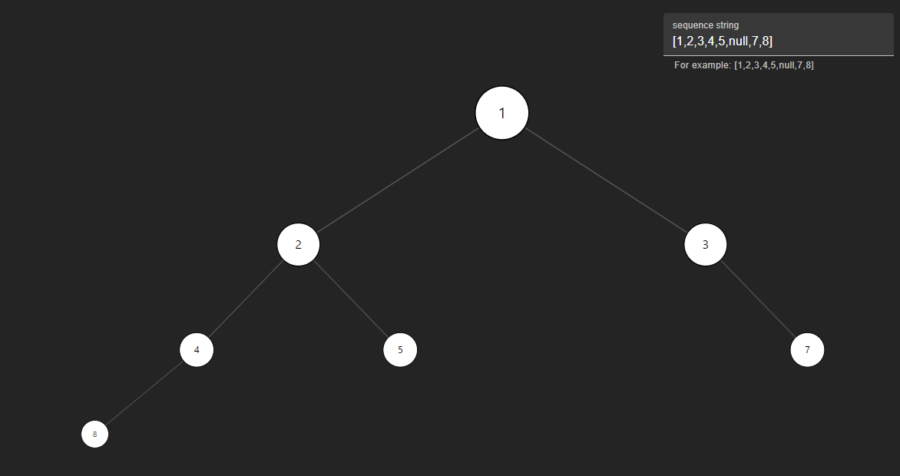

# Ant Visual Tree

Demo site: [Antlab - Ant Visual Tree](https://labs.antknt47.com/ant-visual-tree/) 



Ant Visual Tree is a visualization tool for LeetCode's binary tree level-order traversal strings. It helps users to easily understand and visualize the structure of binary trees from given level-order traversal strings.

## Table of Contents

- [Features](#features)
- [Installation](#installation)
- [Usage](#usage)
- [Team](#team)
- [License](#license)
- [Contact](#contact)

## Features

- **Interactive Visualization**: Easily visualize binary trees.
- **Supports Various Input Formats**: Accepts common level-order traversal string formats.
- **Flexible Operations**: Drag and zoom the tree image with the left mouse button and scroll wheel.

## Installation

To get started with Ant Visual Tree, follow these steps:

### Clone the Repository

```bash
git clone https://github.com/Antknt47/ant-visual-tree.git
cd ant-visual-tree
```

### Install Dependencies

Make sure you have [Node.js](https://nodejs.org/) installed. Then, run the following command:

```bash
npm install
```
Or use yarn:
```bash
yarn
```

## Usage

### Running the Application

To start the application, use the following command:

```bash
npm run dev
```

Or use yarn:
```bash
yarn dev
```


Open your browser and navigate to \`http://localhost:5173\` to see the application in action.

### Visualizing a Tree

1. Enter the level-order traversal string in the input field.
2. Wait a moment for rendeing the tree.

## Team
- [Antknt47](https://github.com/Antknt47)
- [lovemika](https://github.com/2245503751yml)

## License

This project is licensed under the MIT License.
## Contact

If you have any questions or suggestions, feel free to reach out:

- **GitHub**: [Antknt47](https://github.com/Antknt47)
- **Email**: [cometstudio47@gmail.com](mailto:cometstudio47@gmail.com)

We hope you find Ant Visual Tree useful! Happy coding!
